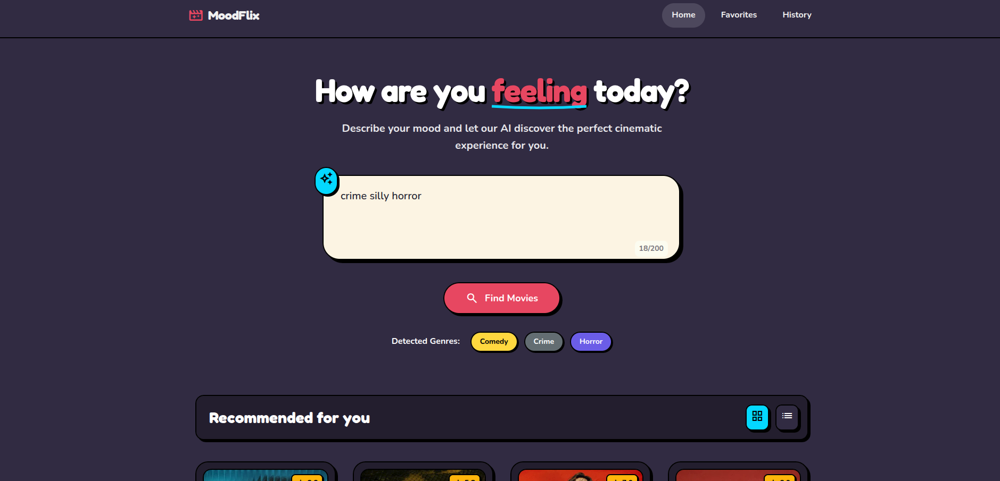

# MoodFlix 🎬

A mood-based movie discovery web application with a playful cartoon/comic-style UI. Describe how you're feeling, and MoodFlix will recommend the perfect movies for you!



## ✨ Features

- **Mood-Based Search**: Describe your mood in natural language and get personalized movie recommendations
- **Smart Genre Detection**: AI-like keyword analysis to detect relevant genres from your mood description
- **Beautiful Cartoon UI**: Playful, vibrant design with hard shadows and comic-style elements
- **Favorites System**: Save your favorite movies for quick access later
- **Search History**: Keep track of your mood searches and easily repeat them
- **Movie Details**: View comprehensive movie information including cast, rating, and trailer links
- **Responsive Design**: Works beautifully on desktop, tablet, and mobile devices
  
## 🚀 Quick Start

### 1. Clone or Download

```bash
git clone https://github.com/yourusername/MoodFlix.git
cd MoodFlix
```

### 2. Open in Browser

Simply open `index.html` in your web browser:

```bash
# On macOS
open index.html

# On Linux
xdg-open index.html

# On Windows
start index.html
```

Or use a local server:

```bash
# Using Python
python -m http.server 8000

# Using Node.js (with http-server)
npx http-server

# Using PHP
php -S localhost:8000
```

Then visit `http://localhost:8000`

### 3. (Optional) Add Your TMDB API Key

For full functionality with real movie data:

1. Go to [TMDB](https://www.themoviedb.org/signup) and create a free account
2. Navigate to Settings → API → Create → Developer
3. Copy your API key
4. Open `js/config.js` and replace `YOUR_TMDB_API_KEY_HERE` with your key:

```javascript
TMDB_API_KEY: 'your_actual_api_key_here',
```

## 📁 Project Structure

```
MoodFlix/
├── index.html          # Main home page
├── favorites.html      # Favorites gallery
├── history.html        # Search history
├── README.md           # This file
├── css/
│   └── styles.css      # All styles (cartoon theme)
├── js/
│   ├── config.js       # Configuration & API settings
│   ├── storage.js      # localStorage management
│   ├── api.js          # TMDB API interactions
│   ├── ui.js           # UI component generation
│   ├── app.js          # Main application logic
│   ├── favorites.js    # Favorites page logic
│   └── history.js      # History page logic
├── assets/             # Images and static assets
└── stitch_screens/     # UI/UX design references
```

## 🎨 Design System

MoodFlix uses a playful cartoon-style design with these key elements:

### Colors
- **Primary Background**: `#2d2640` (Deep Purple)
- **Card Background**: `#1e182a` (Dark Purple)
- **Accent**: `#e94560` (Vibrant Red)
- **Secondary**: `#00d9ff` (Cyan)
- **Text**: `#f1f1f1` (Light) / `#1a1a2e` (Dark)

### Typography
- **Display Font**: Fredoka (headings, logos)
- **Body Font**: Nunito (content, buttons)

### Components
- Hard drop shadows (4px offset)
- 2px solid black borders
- Rounded corners (0.75rem - 2rem)
- Hover lift effects
- Comic-style tags and badges

## 🔧 Configuration

Edit `js/config.js` to customize:

- `TMDB_API_KEY`: Your TMDB API key
- `MOOD_KEYWORDS`: Mood-to-genre mapping rules
- `GENRE_COLORS`: Custom colors for genre tags
- `SETTINGS`: App limits and behavior

## 📱 Browser Support

- Chrome (recommended)
- Firefox
- Safari
- Edge
- Mobile browsers (iOS Safari, Chrome for Android)

## 🤝 Contributing

1. Fork the repository
2. Create your feature branch (`git checkout -b feature/amazing-feature`)
3. Commit your changes (`git commit -m 'Add amazing feature'`)
4. Push to the branch (`git push origin feature/amazing-feature`)
5. Open a Pull Request

## 📄 License

This project is open source and available under the [MIT License](LICENSE).

## 🙏 Acknowledgments

- Movie data provided by [TMDB](https://www.themoviedb.org/)
- Icons by [Google Material Symbols](https://fonts.google.com/icons)
- Fonts by [Google Fonts](https://fonts.google.com/)

---

Made with ❤️ and lots of 🎬
